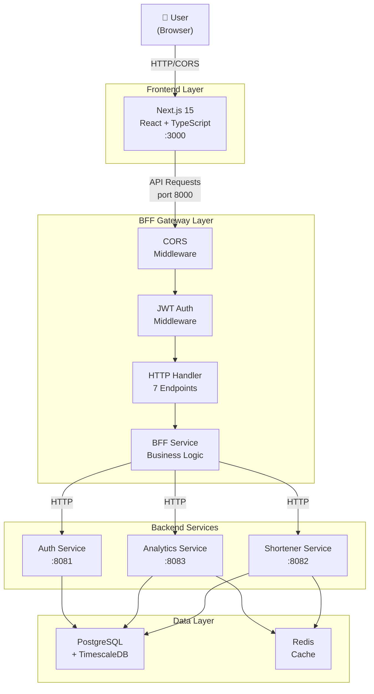
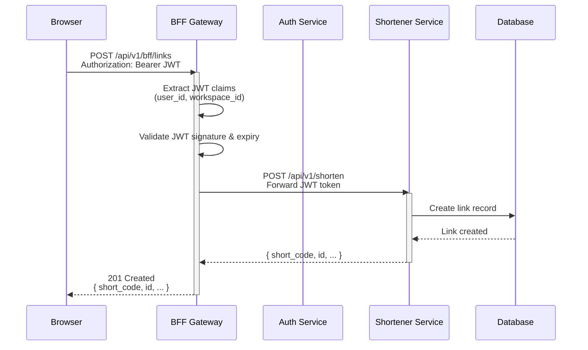
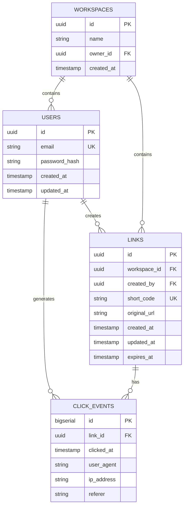

# LinkPulse

Production-grade URL shortener + real-time analytics platform built with modern microservices architecture.

## 🏗️ Architecture Overview



## 🚀 Quick Start

### Prerequisites
- Docker & Docker Compose
- Go 1.25+
- Node.js 18+
- PostgreSQL 16+

### Development

```bash
# Start all services
docker-compose up -d

# Frontend runs on http://localhost:3000
# BFF Gateway runs on http://localhost:8000
# API requests: http://localhost:8000/api/v1/bff/*
```

## 📦 Project Structure

```text
linkpulse/
├── backend/                          # Go microservices
│   ├── services/
│   │   ├── auth/                    # Authentication service
│   │   ├── shortener/               # URL shortening service
│   │   ├── analytics/               # Real-time analytics
│   │   └── web-bff/                 # ✨ Backend-for-Frontend gateway
│   │       ├── cmd/api/
│   │       │   └── main.go          # Service entry point
│   │       ├── internal/
│   │       │   ├── adapters/http/   # HTTP clients to backend services
│   │       │   ├── application/     # Business logic orchestration
│   │       │   ├── domain/          # Models & interfaces
│   │       │   ├── ports/           # Interface contracts
│   │       │   └── presentation/    # HTTP handlers & middleware
│   │       └── Dockerfile
│   └── shared/                       # Shared libraries
├── frontend/                         # Next.js 15 dashboard
│   ├── app/                         # App Router
│   ├── lib/
│   │   └── api.ts                   # Centralized BFF client
│   ├── components/
│   ├── types/
│   └── .env.local                   # Configuration
├── docs/                            # Documentation
├── infra/                           # Terraform + K8s configs
└── docker-compose.yml               # Local development stack
```

## 🔌 API Endpoints

### BFF Gateway (`/api/v1/bff/*`)

All endpoints require JWT authentication via `Authorization: Bearer <token>` header.

| Method | Endpoint | Description | Auth |
|--------|----------|-------------|------|
| POST | `/links` | Create short link | ✅ |
| GET | `/links` | List all links (paginated) | ✅ |
| GET | `/links/:shortCode` | Get link by short code | ✅ |
| PUT | `/links/id/:linkID` | Update link | ✅ |
| DELETE | `/links/id/:linkID` | Delete link | ✅ |
| GET | `/dashboard` | Get dashboard metrics | ✅ |
| GET | `/links/id/:linkID/analytics` | Get link analytics | ✅ |

### Health Check

```bash
GET /health
→ 200 OK
→ { "status": "healthy" }
```

## 🔐 Authentication Flow



## 🛡️ Security Features

### CORS Configuration
```text
Allowed Origins: http://localhost:3000, http://localhost:3001
Allowed Methods: GET, POST, PUT, DELETE, OPTIONS
Allowed Headers: Authorization, Content-Type
Credentials: true
```

### Security Headers
```text
X-Content-Type-Options: nosniff          # Prevent MIME sniffing
X-Frame-Options: DENY                     # Prevent clickjacking
X-XSS-Protection: 1; mode=block          # XSS protection
HSTS: max-age=31536000                    # Force HTTPS
```

### JWT Authentication
- **Token Format:** Bearer `<JWT>`
- **Algorithm:** HS256
- **Claims:** `user_id`, `workspace_id`, `exp` (expiration)
- **Validation:** Signature + expiration checked on every request

## 🏗️ Data Flow - Create Link Example

```mermaid
graph LR
    A["1. User fills form<br/>original_url<br/>custom_alias"] 
    B["2. Submit to BFF"]
    C["3. BFF validates JWT"]
    D["4. Extract workspace_id<br/>from JWT claims"]
    E["5. Call Shortener service"]
    F["6. Generate short code"]
    G["7. Store in database"]
    H["8. Return to frontend"]
    I["9. Show success"]
    
    A -->|Browser| B
    B -->|POST /api/v1/bff/links| C
    C -->|Valid?| D
    D -->|workspace_id| E
    E -->|HTTP Client| F
    F -->|Generate| G
    G -->|Save| H
    H -->|201 Created| I
    
    style A fill:#e1f5ff
    style B fill:#fff3e0
    style C fill:#f3e5f5
    style D fill:#e8f5e9
    style E fill:#fce4ec
    style F fill:#ede7f6
    style G fill:#e0f2f1
    style H fill:#fff9c4
    style I fill:#c8e6c9
```



## 📊 Database Schema - Key Tables



## 🔄 Request/Response Examples

### Create Short Link

**Request:**
```bash
curl -X POST http://localhost:8000/api/v1/bff/links \
  -H "Authorization: Bearer <example...>" \
  -H "Content-Type: application/json" \
  -d '{
    "original_url": "https://www.example.com/very/long/url",
    "custom_alias": "example"
  }'
```

**Response (201 Created):**
```json
{
  "id": "550e8400-e29b-41d4-a716-446655440000",
  "short_code": "example",
  "original_url": "https://www.example.com/very/long/url",
  "created_at": "2026-04-04T14:00:00Z",
  "updated_at": "2026-04-04T14:00:00Z"
}
```

### List Links

**Request:**
```bash
curl -X GET "http://localhost:8000/api/v1/bff/links?page=1&page_size=10" \
  -H "Authorization: Bearer <example...>"
```

**Response (200 OK):**
```json
{
  "data": [
    {
      "id": "550e8400-e29b-41d4-a716-446655440000",
      "short_code": "abc123",
      "original_url": "https://example.com",
      "created_at": "2026-04-04T14:00:00Z"
    }
  ],
  "pagination": {
    "page": 1,
    "page_size": 10,
    "total": 42,
    "total_pages": 5
  }
}
```

### Get Dashboard

**Request:**
```bash
curl -X GET http://localhost:8000/api/v1/bff/dashboard \
  -H "Authorization: Bearer <example...>"
```

**Response (200 OK):**
```json
{
  "total_links": 42,
  "total_clicks": 1250,
  "top_links": [
    {
      "id": "550e8400-e29b-41d4-a716-446655440000",
      "short_code": "abc123",
      "original_url": "https://example.com",
      "clicks": 450
    }
  ],
  "recent_links": [...]
}
```

## 🧪 Testing

### Health Check
```bash
curl http://localhost:8000/health
→ { "status": "healthy" }
```

### CORS Preflight
```bash
curl -X OPTIONS http://localhost:8000/api/v1/bff/links \
  -H "Origin: http://localhost:3000" \
  -H "Access-Control-Request-Method: POST"
→ 204 No Content (with CORS headers)
```

### Without Auth (should fail)
```bash
curl -X POST http://localhost:8000/api/v1/bff/links \
  -H "Content-Type: application/json" \
  -d '{"original_url": "https://example.com"}'
→ 401 Unauthorized
→ { "error": "missing authorization header" }
```

## 🔧 Configuration

### Environment Variables

**Frontend (.env.local)**
```bash
NEXT_PUBLIC_API_BASE=http://localhost:8000
NEXT_PUBLIC_AUTH_BASE=http://localhost:8081
NEXT_PUBLIC_ANALYTICS_BASE=http://localhost:8083
NEXT_PUBLIC_APP_NAME=LinkPulse
```

**Backend (docker-compose.yml)**
```yaml
LINKPULSE_ENVIRONMENT: development
LINKPULSE_SERVER_PORT: 8080
LINKPULSE_JWT_ACCESS_SECRET: super-secret-key-change-in-production
```

## 📋 Service Ports

| Service | Port | Purpose |
|---------|------|---------|
| Frontend (Next.js) | 3000 | Web dashboard |
| BFF Gateway | 8000 | API gateway (public) |
| Auth Service | 8081 | Authentication (internal) |
| Shortener Service | 8082 | URL shortening (internal) |
| Analytics Service | 8083 | Analytics (internal) |
| PostgreSQL | 5432 | Primary database |
| Redis | 6379 | Cache layer |

## 🗂️ Technology Stack

### Backend
- **Language:** Go 1.25
- **Framework:** Gin Web Framework
- **Database:** PostgreSQL 16 + TimescaleDB
- **Cache:** Redis
- **Auth:** JWT (HS256)
- **Logging:** Zap structured logger

### Frontend
- **Framework:** Next.js 15
- **Language:** TypeScript
- **UI:** React 18+
- **Styling:** Tailwind CSS
- **HTTP Client:** Axios

### DevOps
- **Containerization:** Docker
- **Orchestration:** Docker Compose (dev), Kubernetes (prod)
- **IaC:** Terraform
- **CI/CD:** GitHub Actions

## 🎯 BFF Service Features

The Web BFF (Backend-for-Frontend) Gateway provides:

✅ **Single Entry Point** - All frontend requests through one gateway
✅ **CORS Management** - Centralized cross-origin configuration
✅ **Authentication** - JWT validation for all requests
✅ **Service Orchestration** - Coordinates multiple backend services
✅ **Request/Response Transformation** - Adapts backend APIs for frontend
✅ **Error Handling** - Consistent error responses
✅ **Workspace Isolation** - Multi-tenant data segregation
✅ **Security Headers** - Comprehensive security configurations

## 🚀 Deployment

### Local Development
```bash
docker-compose up -d
# Services start automatically with proper dependencies
```

### Production
```bash
# Using Kubernetes (see infra/ directory)
kubectl apply -f infra/kubernetes/

# Or using ArgoCD for GitOps
# Configuration in infra/argocd/
```

## 📚 Additional Documentation

Detailed architecture and implementation documents in `/docs`:
- **CORS_FIX_SUMMARY.md** - CORS implementation and browser preflight handling
- **BFF_IMPLEMENTATION_VERIFICATION.md** - Complete feature checklist
- **BFF_FINAL_SUMMARY.md** - Full implementation overview
- **BFF_CODE_ARCHITECTURE.md** - Code structure and design patterns

## 🤝 Contributing

1. Create a feature branch
2. Make changes following the architecture patterns
3. Run tests and linting
4. Submit a PR with detailed description

## 📝 License

MIT License - See LICENSE file for details

---

**Last Updated:** April 4, 2026
**Status:** 🟢 Production Ready
